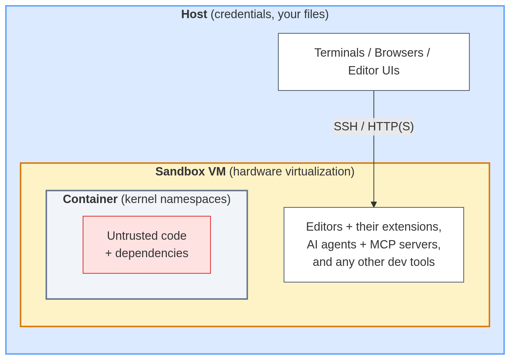
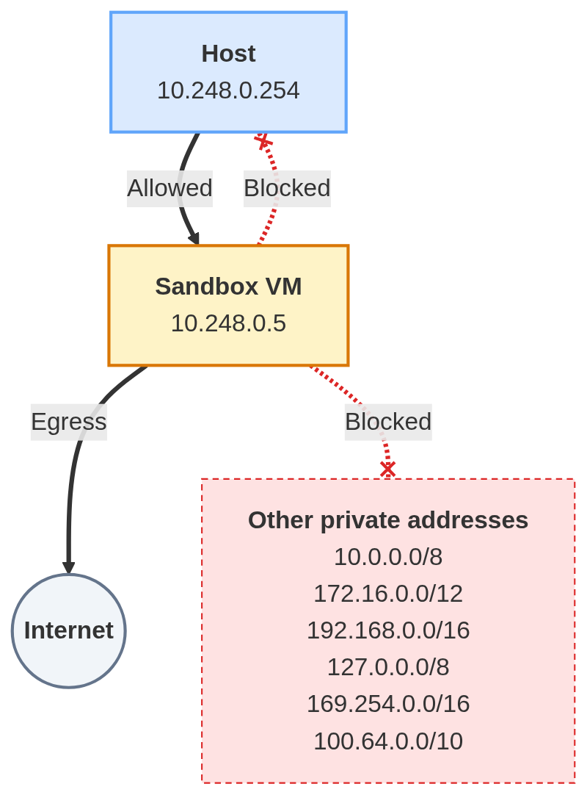

# kvm-sandbox

Gives an AI agent (or any untrusted code) a full, hardened sandbox VM that can
reach the internet but nothing on your network. Sandboxes are persistent,
per-project development VMs: you provision one once (optionally with your own
setup script), then work in it over SSH and manage it through interfaces like
[virt-manager](https://virt-manager.org/) (GUI),
[Cockpit](https://cockpit-project.org/) (web UI), or `virsh` (CLI). See the [blog
post](https://karamatli.com/posts/network-isolated-kvm-sandbox-ai-agents/)
for a complete configuration guide, including context and discussion.

What it does:

- **Isolates the VM from every private address** via nftables: the host it runs
  on, your LAN, your router, other VMs, VPNs, and the cloud metadata IP, unless
  you [allowlist](host-setup/nftables/kvm-sandbox.conf) it per VM. Internet
  access stays unrestricted, NAT'd through the host. A built-in [containment
  check](#check-network-containment-in-a-sandbox) verifies this by port-scanning
  every private address that matters, from the inside.
- **Prevents IP/MAC/ARP spoofing** via libvirt's `clean-traffic`
  [nwfilter](https://libvirt.org/formatnwfilter.html), pinned to the VM's IP, so
  forged frames are dropped at L2 before they reach the bridge.
- **Strips the emulated-device surface**, leaving no graphics, video, sound,
  USB, memory balloon, virtio channels, TPM, or CD-ROM, and switching off the
  chipset's HPET timer. The VM boots via UEFI with Secure Boot off (no SMM
  emulation) and only a serial console attached. Device emulation is where most
  VM escape vulnerabilities have lived, like
  [VENOM](https://en.wikipedia.org/wiki/VENOM). Nested virtualization is also
  disabled, as it exercises KVM's most complex code paths, like the one behind
  the [Januscape](https://github.com/V4bel/Januscape) escape. See the comments
  in the
  [code](https://github.com/ertug/kvm-sandbox/blob/main/kvm_sandbox/manage.py#L299)
  for details.
- **Uses any [cloud image](https://cloud.debian.org/images/cloud/)** (Debian 13
  by default) to create a headless VM, copying its disk from a cached download
  (checks for an update on each run) so each new sandbox spins up in seconds.
- **Applies [cloud-init](https://cloudinit.readthedocs.io/)** to create your
  user, install your SSH key, set a console/sudo password, pin a static IPv4
  address (no DHCP, IPv6 disabled), and configure a public DNS resolver.
- **Runs on [KVM](https://en.wikipedia.org/wiki/Kernel-based_Virtual_Machine)**,
  the hypervisor underneath much of the public cloud, which carries more
  scrutiny and hardening than any newer option. It's a full virtualization layer
  built into the Linux kernel, adding no new runtime, orchestrator, or vendor to
  your trust base, and it runs with near-native performance.

It is designed to be distro-agnostic, with any cloud-init cloud image on the
guest and a plain libvirt/KVM stack on the host (the host setup is only tested
on Debian).

<table>
<tr>
<td align="center">

</td>
<td align="center">

</td>
</tr>
</table>

## Prerequisites

- **System packages:**
  [`qemu-system-x86`](https://www.qemu.org/)
  [`qemu-utils`](https://www.qemu.org/)
  [`libvirt-daemon-system`](https://libvirt.org/)
  [`virt-install`](https://virt-manager.org/)
  [`ovmf`](https://www.tianocore.org/)
  [`xorriso`](https://www.gnu.org/software/xorriso/)
  [`nftables`](https://nftables.org/)
  `curl` `openssl` `sudo` `iputils-ping` (Debian/Ubuntu names; the last four
   are typically already installed)
- **Python:** 3.8+, standard library only.
- **Bridge network:** a libvirt network definition is provided
  ([`host-setup/libvirt-net/kvm-sandbox.xml`](host-setup/libvirt-net/kvm-sandbox.xml)).
- **Firewall rules:** a drop-in nftables ruleset is provided
  ([`host-setup/nftables/kvm-sandbox.conf`](host-setup/nftables/kvm-sandbox.conf)).
- **IP forwarding:** a drop-in sysctl config is provided
  ([`host-setup/sysctl/99-kvm-sandbox.conf`](host-setup/sysctl/99-kvm-sandbox.conf)).
- **SSH key:** run `ssh-keygen -t ed25519` if you don't already have one.

See the [configuration
guide](https://karamatli.com/posts/network-isolated-kvm-sandbox-ai-agents/#configuration-guide)
for a complete walkthrough.

## Usage

The VM name encodes the address: `sandbox<n>` comes up at `10.248.0.<n>` by
default, and an optional `-<label>` after the number is just for your own
bookkeeping. So `sandbox5-dev` lands at `10.248.0.5`.

### Create a sandbox

Run as your normal user (it calls `sudo` itself; don't run it as root):

```bash
./kvm-sandbox create sandbox5                     # IP 10.248.0.5
./kvm-sandbox create sandbox6-my-project          # IP 10.248.0.6
./kvm-sandbox create sandbox7 --memory 2048 --vcpus 2 --disk 20G
./kvm-sandbox create sandbox8 --provision ./provision/claude-code.sh
```

It waits for the VM to come up on its IP. Note that cloud-init (initial
provisioning) may still be finishing in the background for some time.

`--memory`, `--vcpus`, and `--disk` each override their
[`sandbox_config.py`](https://github.com/ertug/kvm-sandbox/blob/main/sandbox_config.py)
default for that run. Everything else is set in `sandbox_config.py`: cloud
image, login user, SSH key, nameservers, autostart, and the host topology
(host_address, bridge, image_dir). By default `image_url`/`osinfo` point at
Debian 13; to use another cloud image, set them to match (see `osinfo-query os`
for ids).

`--provision` copies an arbitrary executable (a script with a shebang
line, or a binary) from the host into the VM and runs it as root once, on
first boot — useful for initial provisioning like installing dev tools. It is
embedded in the cloud-init config, written to `/root/<filename>` in the
guest, and its output ends up in `/var/log/cloud-init-output.log` there.

The VM password (console login + sudo) is prompted for interactively by
default. To skip the prompt (e.g. for convenience or automated runs), set the
`KVM_SANDBOX_PASSWORD` environment variable, or set `password` in
`sandbox_config.py`, where it's stored in the clear.

Once the VM exists, the [`virt-manager`](https://virt-manager.org/) GUI is the
easiest way to handle everything else (start/stop, open a console, tweak
resources, [share a host folder](https://libvirt.org/kbase/virtiofs.html),
save/restore, enable autostart, etc.), so you rarely need to touch `virsh`
directly. [Cockpit](https://cockpit-project.org/) (with its `cockpit-machines`
plugin) covers the same ground from a web UI.

### Delete a sandbox

To remove a VM along with its disk (asks for confirmation first):

```bash
./kvm-sandbox delete <name>
```

### Check network containment in a sandbox

To verify that a running sandbox really is contained, with no reach into
private networks:

```bash
./kvm-sandbox check sandbox5
```

It SSHes into the VM and runs `nmap` (SYN and UDP scans, via `sudo` in the
guest) against every private address that matters: it automatically enumerates
the host interfaces, LAN router, LAN devices, every other running sandbox, the
cloud-metadata IP, and a representative address per private block.

`nmap` and `curl` must be installed in the VM; pass `--install-tools` to have
the check install them (via `apt-get`) before probing. The private ranges probed are set by
`check_private_nets` in `sandbox_config.py` (add any overlay/VPN range you run),
and the ports scanned on each address by `check_tcp_ports` and
`check_udp_ports`.

It first runs an internet reachability check, then reports every private
address/port the VM can reach. Exit code: 0 on pass, 1 if any private service
is reachable, 2 on errors (SSH, missing tools, scan failure).

## Tests

Integration tests run the real script against your host: they create an actual
VM, wait for SSH, and delete it again. On a host set up per the prerequisites
above, run from the repo root:

```bash
python3 -m unittest discover -s tests -v
```
